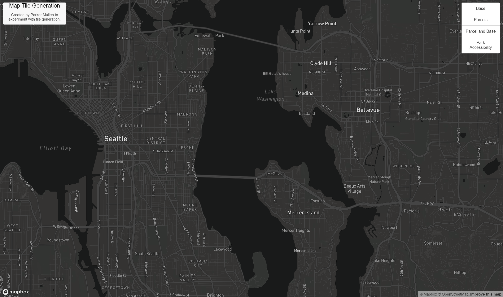
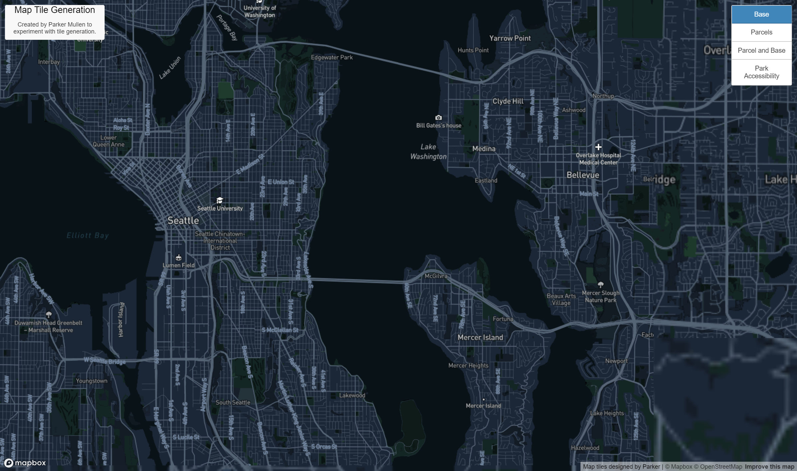
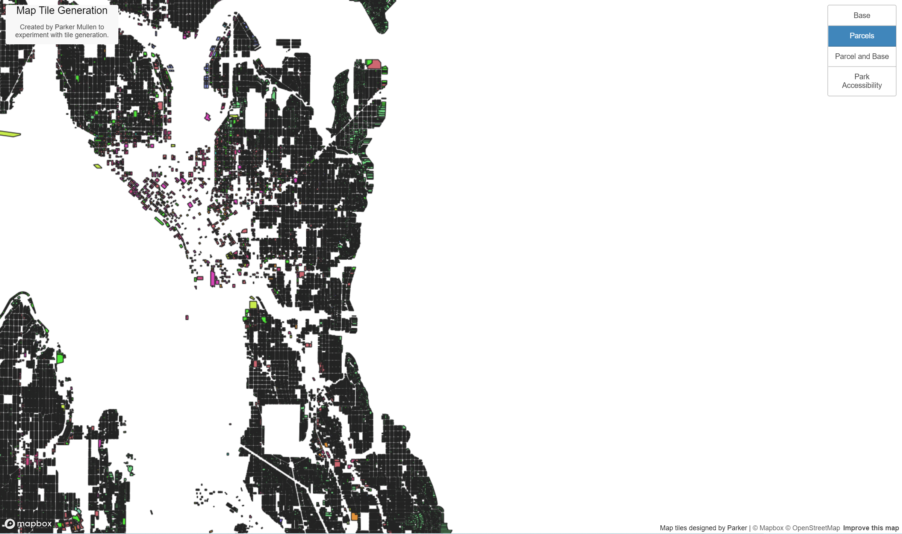
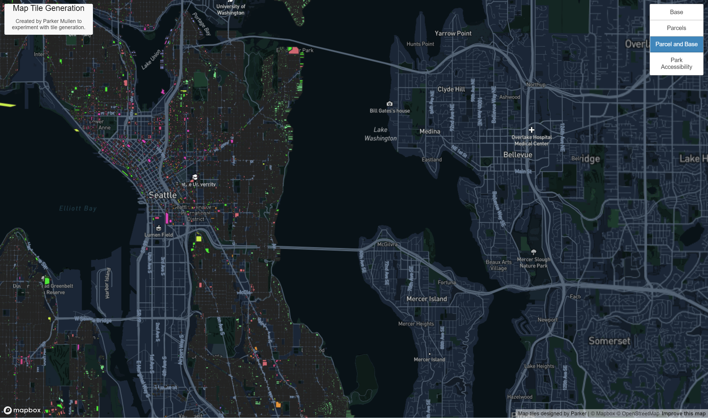
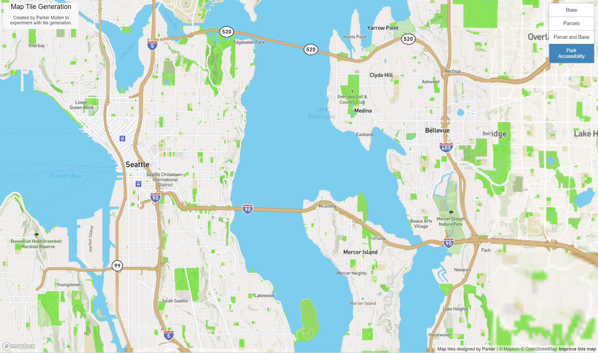

# Tile Generation
**Parker Mullen**
5/5/2022

## Overview

[Link to the map](https://mullepd.github.io/mullen_tile_generation/)

This tile generation experiment covered the area surrounding Seattle mostly because I have easily accessible thematic data for this area.
Each tile layer has a zoom level from 1 to 15.
The basic tile layer is a layer made using Mapbox's base studio options, the thematic tile layer is based on parcel address shapefiles which comes from Seattle's open GIS data portal, the thematic+base tile layer is simply a combination of the two previous tile layers. Finally, the nature tile layer is another layer made using Mapbox's studio. I tried to highlight parks in the Seattle area as a way to look at accessibility.

## Screenshots

This is the base layer that one can load in using Mapbox.gl

Here is the custom basemap tile layer I made.

This is a tile set based on parcel shapefiles from Seattle Open GIS portal. I tried removing the white background by playing with the QTiles Transparency option, but anything above 0 broke the whole webpage.

This is a tile layer based upon my custom basemap and parcel thematic layer.

Here is a basemap I customized to highlight parks in the Seattle area.